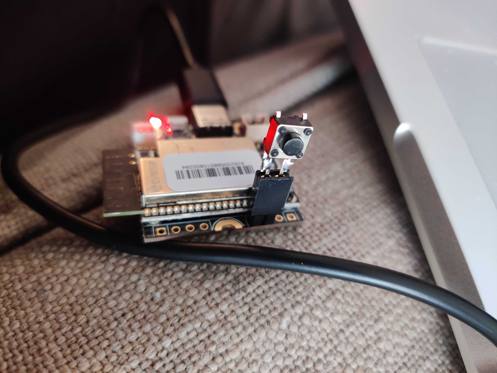
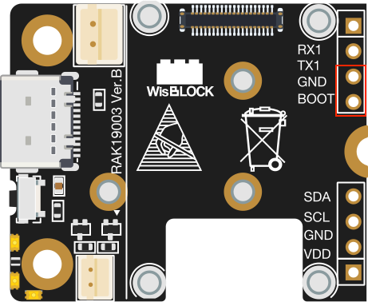

# RAKWireless MQTT Soil Monitor

This project features RAKWireless boards and modules (mini base board with solar and LiPo power, soil moisture probe, temperature/humidity sensor) that publishes state over MQTT. Designed for integration with [Home Assistant](https://www.home-assistant.io/).

## Hardware

- [RAK11200 ESP32-WROVER WisBlock WiFi Module](https://docs.rakwireless.com/Product-Categories/WisBlock/RAK11200/Overview/)
- [RAK19003 WisBlock Mini Base Board](https://docs.rakwireless.com/Product-Categories/WisBlock/RAK19003/Overview/)
- [RAK1901 WisBlock Temperature and Humidity Sensor](https://docs.rakwireless.com/Product-Categories/WisBlock/RAK1901/Overview/)
- [RAK12023 WisBlock Soil Moisture Sensor Connector Module](https://docs.rakwireless.com/Product-Categories/WisBlock/RAK12023/Overview/)
    - May be replaced by RAK12028
- [RAK12035 WisBlock Soil Moisture Sensor Module](https://docs.rakwireless.com/Product-Categories/WisBlock/RAK12035/Overview/)
- [Solar Board](https://store.rakwireless.com/products/solar-board-1)
- [Battery connector wires](https://store.rakwireless.com/products/battery-connector-cable)
- [18650 Battery Holder Case](https://www.amazon.ca/gp/product/B07M87NPXB)
- Reconditioned 18650 cells

## Software

- [MQTT Explorer](http://mqtt-explorer.com/)

### Arduino Boards

Add these URLs to the "Additional board manager URLs" in the Arduino IDE preferences:

```
https://raw.githubusercontent.com/RAKwireless/RAKwireless-Arduino-BSP-Index/main/package_rakwireless_index.json
https://raw.githubusercontent.com/RAKwireless/RAKwireless-Arduino-BSP-Index/main/package_rakwireless.com_rui_index.json
```

Following this you can search for "RAKwireless ESP32 Modules" (or keyword: RAK11200) in the board manager, then install.

### Arduino Libraries

- [knolleary/PubSubClient](https://github.com/knolleary/pubsubclient/) (download & import .zip)
- [SparkFun SHTC3 Humidity and Temperature Sensor Library
](https://github.com/sparkfun/SparkFun_SHTC3_Arduino_Library) (install from library manager)


## Setup

- Install Arduino boards via manager
- Install Arduino libraries via manager (or download and import .zip)
- Solder male header pins into BOOT and GND

## Programming

The RAK11200 ESP32 module has a BOOT pin that must be pulled to GND to enable upload/programming mode. The RAK19003 Mini Base Board exposes this pin on the edge headers. A wire may be used to short BOOT and GND, or you can solder male header pins and use a jumper (provided with the base board kit) to enable boot mode. A small SPST tactile pushbutton switch can be soldered to leads of female headers, creating a dedicated boot switch.

 

Programming sequence:

1. Hold BOOT switch / short BOOT pin to GND
1. Press reset button
1. Release BOOT switch / disconnect BOOT-GND short
1. Click "upload" from Arduino IDE
1. Wait for `Hard resetting via RTS pin...` log line
1. Press reset button again

Now your ESP32 module should be running your code. Open the Arduino IDE serial monitor at 115200 baud to view printed output.

## References & External Documentation

- https://github.com/RAKWireless/WisBlock/tree/master/examples/RAK11200/solutions/mqtt_subscribe_publish
- https://docs.rakwireless.com/Product-Categories/WisBlock/RAK11200/Datasheet/#hardware
- https://github.com/knolleary/pubsubclient

## ToDo

- [ ] Cleaner MQTT publishing method (wrap string formatting and serial printing)
- [ ] Low-power operation
- [ ] Soil moisture sensor
- [ ] Improved battery measurement curve
- [ ] MQTT topic updatable from MQTT message
- [ ] Linting & tests
